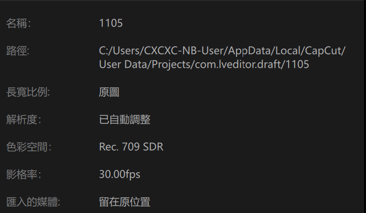

# 剪映字幕提取工具

從剪映專案資料夾中找到 `draft_content.json`，提取字幕並保存為 txt 文件。



## 功能特點

- ✅ 提取剪映字幕文字
- ✅ 保留時間軸順序
- ✅ 顯示時間標記
- ✅ 輸出為 txt 格式
- ✅ 自動檢測字幕類型（text/subtitle/sticker）

## 使用方法

### 方法 1：命令行參數

```bash
python main.py draft_content.json
```

### 方法 2：互動式輸入

```bash
python main.py
```

然後根據提示輸入檔案路徑。

## 輸出格式

字幕會以以下格式保存到 `output.txt`：

```
[00:00:05 --> 00:00:08]
這是第一句字幕

[00:00:10 --> 00:00:15]
這是第二句字幕

...
```

## 注意事項

- 支援剪映使用的微秒時間格式
- 自動處理不同版本的剪映檔案結構
- 如果時間顯示異常，可能需要調整時間單位（修改代碼中的 `1_000_000.0` 為 `1000`）

## 系統需求

- Python 3.6+
- 無需額外依賴套件
